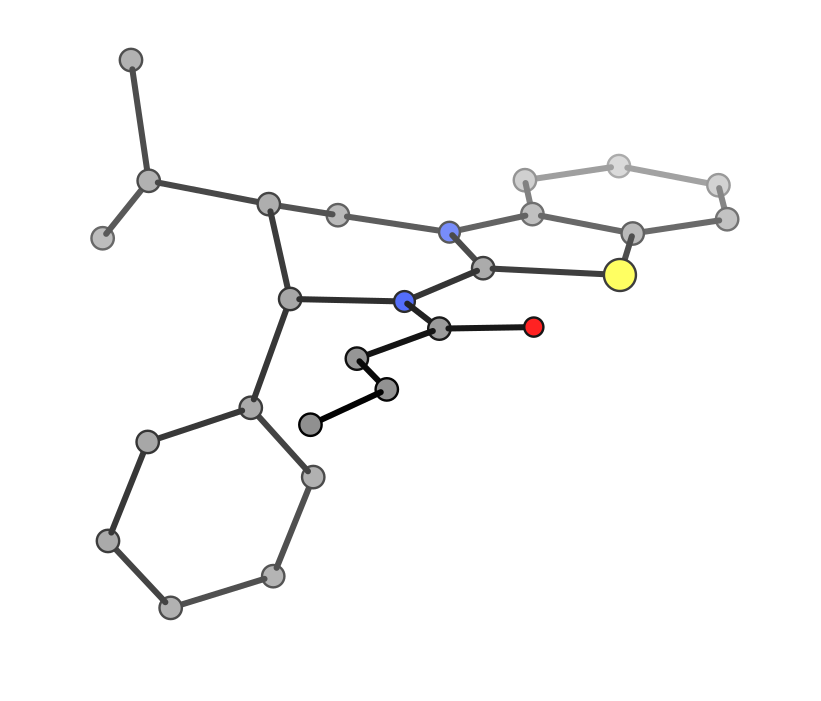

# xyzgraph: Molecular Graph Construction from Cartesian Coordinates

**xyzgraph** is a Python toolkit for building molecular graphs (bond connectivity, bond orders, formal charges, and partial charges) directly from 3D atomic coordinates in XYZ format. It provides both **cheminformatics-based** and **quantum chemistry-based** (xTB) workflows.

[](https://pepy.tech/projects/xyzgraph)
[](https://github.com/aligfellow/xyzgraph/blob/main/LICENSE)
[](https://docs.astral.sh/uv)
[](https://github.com/astral-sh/ruff)
[](https://github.com/astral-sh/ty)
[](https://github.com/aligfellow/xyzgraph/actions)
[](https://codecov.io/gh/aligfellow/xyzgraph)


---

## Table of Contents

1. [Key Features](#key-features)
2. [Installation](#installation)
3. [Quick Start](#quick-start)
4. [Methodology Overview](#methodology-overview)
5. [Workflow Comparison](#workflow-comparison)
6. [CLI Reference](#cli-reference)
7. [Python API](#python-api)
8. [Visualization](#visualization)
9. [Non-Covalent Interactions](#non-covalent-interactions)
10. [Limitations & Future Work](#limitations--future-work)
11. [Examples](#examples)
12. [References](#references)
13. [Contributing & Contact](#contributing--contact)

---

## Key Features

- **Distance-based initial bonding** using *consistent* van der Waals radii across *all elements* from Charry and Tkatchenko [[1]](https://doi.org/10.1021/acs.jctc.4c00784)
- **Four construction methods**:
  - `cheminf`: Pure cheminformatics with bond order optimization
  - `xtb`: Semi-empirical calculation via xTB Wiberg bond orders with Mulliken charges [[2]](https://pubs.acs.org/doi/10.1021/acs.jctc.8b01176)
  - `rdkit`: RDKit's DetermineBonds algorithm [[3]](https://github.com/jensengroup/xyz2mol), [[4]](https://github.com/rdkit)
  - `orca`: Reads Mayer bond orders and Mulliken charges from ORCA outputs.
- **Cheminformatics modes**:
  - `--quick`: Fast (crude) valence adjustment
  - Full optimization with valence and charge minimisation
    - `--optimizer`:  
      **beam**: optimization across multiple paths (slightly slower, default)  
      **greedy**: iterative valence adjustment
- **Aromatic detection**: Hückel 4n+2 rule for 6-membered rings
- **Charge computation**: Gasteiger (cheminf) or Mulliken (xTB/ORCA) partial charges
- **RDkit/xyz2mol comparison** validation against RDKit bond perception [[3]](https://github.com/jensengroup/xyz2mol), [[4]](https://github.com/rdkit)
- **Non-covalent interaction (NCI) detection**: 17 interaction types including hydrogen bonds, pi-stacking, halogen/chalcogen/pnictogen bonds, cation-pi, and more
- **ASCII 2D depiction** with layout alignment for method comparison (see also [[5]](https://github.com/whitead/moltext))

---

## Installation

### From PyPI

```bash
pip install xyzgraph
```

### From Source

```bash
git clone https://github.com/aligfellow/xyzgraph.git
cd xyzgraph
pip install .
# or simply
pip install git+https://github.com/aligfellow/xyzgraph.git
```

### Dependencies

- **Core**: `numpy`, `networkx`, `rdkit`
- **Optional**: [xTB binary](https://github.com/grimme-lab/xtb) (for `--method xtb`)
- **Optional**: [xyz2mol_tm](https://github.com/jensengroup/xyz2mol_tm) + `scipy` (for `--compare-rdkit-tm`)

To install xTB (Linux/macOS) see [here](https://github.com/grimme-lab/xtb):

```bash
conda install -c conda-forge xtb # or download from GitHub releases
```

To install xyz2mol_tm (required for `--compare-rdkit-tm`):

```bash
pip install "xyzgraph[rdkit-tm]" xyz2mol_tm@git+https://github.com/jensengroup/xyz2mol_tm.git
```

This installs `scipy` (via the `rdkit-tm` extra) and `xyz2mol_tm` from source in one command. This extra step is necessary because `xyz2mol_tm` is not hosted on `pypi`.

---

## Quick Start

### CLI Examples

**Minimal usage** (auto-displays ASCII depiction):

```bash
xyzgraph molecule.xyz   # constructs graph with cheminformatics style defaults
xyzgraph molecule.out   # constructs graph from ORCA output
```

**Specify charge and method**:

```bash
xyzgraph molecule.xyz --method xtb --charge -1 --multiplicity 2
```

**Detailed debug output**:

```bash
xyzgraph molecule.xyz --debug
```

**Compare with RDKit**:

```bash
xyzgraph molecule.xyz --compare-rdkit
```

**Compare with ORCA output**:

```bash
# Compare XYZ (cheminf) vs ORCA bond orders
xyzgraph molecule.xyz --orca-out molecule.out

# Three-way comparison: cheminf vs ORCA vs RDKit
xyzgraph molecule.xyz --orca-out molecule.out --compare-rdkit
```

**Detect non-covalent interactions**:

```bash
xyzgraph molecule.xyz --nci --charge 1
```

**Multi-frame trajectory files**:

```bash
# Process specific frame from trajectory (0-indexed)
xyzgraph trajectory.xyz --frame 2

# Process all frames for quick topological overview
xyzgraph trajectory.xyz --all-frames
```

### Python Example

**Basic usage**:

```python
from xyzgraph import build_graph, build_graph_rdkit, build_graph_orca

# Cheminformatics (default method)
G_cheminf = build_graph("molecule.xyz", charge=0)

# RDKit's DetermineBonds
G_rdkit = build_graph_rdkit("molecule.xyz", charge=0)

# ORCA output (Mayer bond orders)
G_orca = build_graph_orca("structure.out", bond_threshold=0.5)

# Print ASCII structure
from xyzgraph import graph_to_ascii
print(graph_to_ascii(G_cheminf, scale=3.0, include_h=False))
```

**Multi-frame trajectory files**:

```python
from xyzgraph import read_xyz_file, build_graph

# Read specific frame from trajectory
atoms = read_xyz_file("trajectory.xyz", frame=2)
G = build_graph(atoms, charge=0)

# Process all frames
from xyzgraph import count_frames_and_atoms
num_frames, _ = count_frames_and_atoms("trajectory.xyz")
for i in range(num_frames):
    atoms = read_xyz_file("trajectory.xyz", frame=i)
    G = build_graph(atoms, charge=0)
    # ... analyze G
```

**Non-covalent interaction detection**:

```python
from xyzgraph import build_graph
from xyzgraph.nci import detect_ncis

G = build_graph("molecule.xyz", charge=1)
ncis = detect_ncis(G)

for nci in ncis:
    print(nci.type, nci.site_a, nci.site_b, nci.geometry)
```

**Comparing methods**:

```python
from xyzgraph import compare_with_rdkit

# Build graphs
G_cheminf = build_graph("molecule.xyz", charge=-1)
G_rdkit = build_graph_rdkit("molecule.xyz", charge=-1)

# Compare (returns formatted report)
report = compare_with_rdkit(G_cheminf, G_rdkit, verbose=True, ascii=True)
print(report)
```

---

## Methodology Overview

### Design Philosophy

xyzgraph offers two distinct pathways for molecular graph construction:

1. **Cheminformatics Path** (`method='cheminf'`): 
   - Pure graph-based approach using chemical heuristics
   - No external quantum chemistry calls
   - Cached scoring, valence, edge and graph properties
   - Fast and suitable for both organic *and* inorganic molecules

2. **Quantum Chemistry Path** (`method='xtb'`):
   - Uses GFN2-xTB (extended tight-binding) calculations [[2]](https://pubs.acs.org/doi/10.1021/acs.jctc.8b01176)
   - Reads in Wiberg bond orders and Mulliken charges from output
   - Potentially more accurate for unusual bonding situations 
      - *though, xTB may be less robust in these situations*
   - Requires xTB binary installation

### Cheminformatics Workflow (method='cheminf')

```
┌─────────────────────────────────────────────────────────────────┐
│ 1. Input Processing                                             │
│    • Parse XYZ file internally                                  │
│    • Load reference data (VDW radii, valences, electrons)       │
└────────────────────┬────────────────────────────────────────────┘
                     │
┌────────────────────▼────────────────────────────────────────────┐
│ 2. Initial Bond Graph (Two-Step Construction)                   │
│                                                                 │
│    Step 1: Baseline Bonds (DEFAULT thresholds)                  │
│    • Uses DEFAULT threshold parameters (threshold=1.0)          │
│    • Builds reliable "core" connectivity                        │
│    • Bonds sorted by confidence: 1.0 (short) to 0.0 (at thresh) │
│    • High confidence (>0.4): added directly                     │
│    • Low confidence (≤0.4): geometric validation applied        │
│    • Result: stable molecular scaffold                          │
│    • Compute rings using NetworkX cycle_basis                   │
│                                                                 │
│    Step 2: Extended Bonds (if using CUSTOM thresholds)          │
│    • Sorted highest-confidence-first (most reliable first)      │
│    • Additional bonds require geometric validation:             │
│      - Acute angle check: 15° (metals) / 30° (non-metals)       │
│      - Collinearity check: trans vs spurious detection          │
│      - Existing ring diagonal rejection and 3-ring validation   │
|      - Agostic bond filtering: H-M/F-M bonds rejected if        │
│        stronger H-X or F-X bond exists (2x confidence ratio)    │
│      - M-L priority check: diagonal M-ligand bonds in 3-rings   │
│        rejected if stronger M-donor bond exists in ring (2x)    │
│    • Allows sensible elongated bonds (e.g., TS structures)      │
│                                                                 │
│    • Create graph with single bonds (order = 1.0)               │
└────────────────────┬────────────────────────────────────────────┘
                     │
┌────────────────────▼────────────────────────────────────────────┐
│ 3. Kekulé Initialization for Conjugated Rings                   │
│    • Find 5/6-membered planar rings with C/N/O/S/B/P/Se         │
│    • Initialize alternating bond orders (5-ring: 2-1-2-1-1,     │
│      6-ring: 2-1-2-1-2-1)                                       │
│    • Handle fused rings (naphthalene, anthracene):              │
│      - Detecting shared edges from previous rings               │
│      - Validated across extended ring system                    │
│    • Gives optimizer excellent starting point                   │
│    • Reduces iterations needed for conjugated systems           │
│    • Broader atom set than aromatic detection (P, Se included)  │
└────────────────────┬────────────────────────────────────────────┘
                     │
          ┌──────────┴─────────────┐
          │                        │
┌─────────▼────────────┐   ┌───────▼──────────────────────────────┐
│ 4a. Quick Mode       │   │ 4b. Full Optimization                │
│  • Lock metal bonds  │   │  • Lock metal bonds at 1.0           │
│  • 3 iterations      │   │  • Iterative BIDIRECTIONAL search:   │
│  • Promote bonds     │   │    - Test both +1 AND -1 changes     │
│    where both atoms  │   │    - Allows Kekulé structure swaps   │
│    need increased    │   │  • Score = f(valence_error,          │
│    valence           │   │             formal_charges,          │
│  • Distance check    │   │             electronegativity,       │
│                      │   │             conjugation_penalty)     │
│                      │   │  • Optimizer choice:                 │
│                      │   │    - Beam: parallel hypotheses       │
│                      │   │    - Greedy: single best change      │
│                      │   │  • Cache where possible for speed    │
│                      │   │  • Top-k edge candidate selection    │
└─────────┬────────────┘   └──────────┬───────────────────────────┘
          └───────────────────────────┘
                     │
┌────────────────────▼────────────────────────────────────────────┐
│ 5. Aromatic Detection (Hückel 4n+2)                             │
│    • Find 5/6-membered rings with C/N/O/S/B                     │
│    • Count π electrons (sp² carbons → 1e, N/O/S LP → 2e)        │
│    • Apply Hückel rule: 4n+2 π electrons                        │
│    • Set aromatic bonds to 1.5                                  │
│    • Other heteroatoms (e.g. P, Se) use Kekulé structures       │
└────────────────────┬────────────────────────────────────────────┘
                     │
┌────────────────────▼────────────────────────────────────────────┐
│ 6. Formal Charge Assignment                                     │
│    • For each non-metal atom:                                   │
│      - B = 2 × Σ(bond_orders)                                   │
│      - L = max(0, target - B)  [target: 2 for H, 8 otherwise]   │
│      - formal = V_electrons - (L + B/2)                         │
│    • Balance total to match system charge                       │
│    • Metals assigned oxidation state as formal charge           │
└────────────────────┬────────────────────────────────────────────┘
                     │
┌────────────────────▼────────────────────────────────────────────┐
│ 7. Optional: Gasteiger Partial Charges                          │
│    • compute_gasteiger_charges(G, target_charge)                │
│    • Convert bond orders to RDKit bond types                    │
│    • Compute Gasteiger charges                                  │
│    • Adjust for total charge conservation                       │
│    • Aggregate H charges onto heavy atoms                       │
│    • Stored in G.nodes[i]["charges"]["gasteiger"]               │
└────────────────────┬────────────────────────────────────────────┘
                     │
┌────────────────────▼────────────────────────────────────────────┐
│ 8. Optional: Non-Covalent Interaction Detection (--nci)         │
│    • Classify sites: donors, acceptors, ions, halogens, etc.    │
│    • Detect pi-systems: aromatic rings + conjugated domains     │
│    • Enumerate candidate pairs (graph-distance filtered)        │
│    • Geometry checks: distances, angles, plane alignment        │
│    • 17 interaction types (H-bond, pi-stack, sigma-hole, ...)   │
│    • Stored in G.graph["ncis"] as list[NCIData]                 │
└────────────────────┬────────────────────────────────────────────┘
                     │
┌────────────────────▼────────────────────────────────────────────┐
│ 9. Output Graph                                                 │
│    Nodes: symbol, formal_charge, valence, metal_valence,        │
│           oxidation_state (metals only)                         │
│    Edges: bond_order, bond_type, metal_coord                    │
└─────────────────────────────────────────────────────────────────┘
```

### xTB Workflow (method='xtb')

```
┌─────────────────────────────────────────────────────────────────┐
│ 1. Input Processing                                             |
│    • Parse XYZ file internally                                  │
│    • Write XYZ to temporary directory                           │
│    • Set up xTB calculation parameters                          │
└────────────────────┬────────────────────────────────────────────┘
                     │
┌────────────────────▼────────────────────────────────────────────┐
│ 2. Run xTB Calculation                                          │
│    Command: xtb <file>.xyz --chrg <charge> --uhf <unpaired>     │
│    • GFN2-xTB Hamiltonian                                       │
│    • Single-point calculation                                   │
│    • Wiberg bond order analysis                                 │
│    • Mulliken population analysis                               │
└────────────────────┬────────────────────────────────────────────┘
                     │
┌────────────────────▼────────────────────────────────────────────┐
│ 3. Parse xTB Output                                             │
│    • Read wbo file (Wiberg bond orders)                         │
│    • Read charges file (Mulliken atomic charges)                │
│    • Threshold: bond_order > 0.5 → create edge                  │
└────────────────────┬────────────────────────────────────────────┘
                     │
┌────────────────────▼────────────────────────────────────────────┐
│ 4. Build Graph from xTB Data                                    │
│    • Create nodes with Mulliken charges                         │
│    • Create edges with Wiberg bond orders                       │
│    • No further optimization needed                             │
└────────────────────┬────────────────────────────────────────────┘
                     │
┌────────────────────▼────────────────────────────────────────────┐
│ 5. Cleanup (optional)                                           │
│    • Remove temporary xTB files (unless --no-clean)             │
└────────────────────┬────────────────────────────────────────────┘
                     │
┌────────────────────▼────────────────────────────────────────────┐
│ 6. Output Graph                                                 │
│    Nodes: symbol, charges{'mulliken': ...}, agg_charge,         │
│           valence, metal_valence                                │
│    Edges: bond_order (Wiberg), bond_type, metal_coord           │
└─────────────────────────────────────────────────────────────────┘
```

---

## Workflow Comparison

| Feature | cheminf (quick) | cheminf (full) | xtb |
|---------|----------------|----------------|-----|
| **Speed** | Very Fast | Fast | Moderate |
| **Accuracy** | Okay for simple molecules | Very good across various systems | Only limited by xTB performance (QM-based) |
| **External deps** | None | None | Requires xTB binary |
| **Bond orders** | Heuristic (integer-like) | Optimized formal charge and valency | Wiberg (fractional) |
| **Charges** | Gasteiger | Gasteiger | Mulliken |
| **Metal complexes** | Limited | Reasonable | Reasonable (limited by xTB metal performance) |
| **Conjugated systems** | Basic | Excellent | Excellent |
| **Best for** | Quick checks, where connectivity most important | Most cases | Awkward bonding, validation |

### When to Use Each Method

**Use `--method cheminf` (default)**:

- Most use cases
- No xTB installation available
- Batch processing structures

**Use `--method cheminf --quick`**:

- Extremely large molecules
- Initial rapid screening
- When approximate bond orders suffice

**Use `--method xtb`**:

- Validation of cheminf results
- Unusual electronic structures
- Low confidence in bonding structure

### Optimizer Algorithms (cheminf full mode only)

**Beam Search Optimizer** (`--optimizer beam` default, `--beam-width 5` default):

- Explores multiple optimization paths in parallel
- Maintains top-k hypotheses at each iteration (of top candidates)
- Bidirectional: tests both +1 and -1 bond orders for each hypothesis
- More robust against local minima
- Slower, but better convergence
- Best for robust bonding assignment across periodic table

**Greedy Optimizer** (`--optimizer greedy`):

- Tests all top candidate edges, picks single best change per iteration
- Bidirectional: tests both +1 and -1 bond order changes
- Fast and effective for most molecules
- Can get stuck in local minima (*e.g.* alpha, beta unsaturated systems)

---

## CLI Reference

### Command Syntax

```text
> xyzgraph -h
usage: xyzgraph [-h] [--version] [--citation] [--method {cheminf,xtb}] [--no-clean] [-c CHARGE] [-m MULTIPLICITY] [-q] [--relaxed] [-t THRESHOLD] [-d] [-a] [--json] [-as ASCII_SCALE] [--nci]
                [-H] [--show-h-idx SHOW_H_IDX] [-b] [--frame FRAME] [--all-frames] [--compare-rdkit] [--compare-rdkit-tm] [--orca-out ORCA_OUT] [--orca-threshold ORCA_THRESHOLD]
                [-o {greedy,beam}] [-bw BEAM_WIDTH] [--max-iter MAX_ITER] [--edge-per-iter EDGE_PER_ITER] [--bond BOND] [--unbond UNBOND] [--threshold-h-h THRESHOLD_H_H]
                [--threshold-h-nonmetal THRESHOLD_H_NONMETAL] [--threshold-h-metal THRESHOLD_H_METAL] [--threshold-metal-ligand THRESHOLD_METAL_LIGAND]
                [--threshold-nonmetal THRESHOLD_NONMETAL] [--allow-metal-metal-bonds] [--threshold-metal-metal-self THRESHOLD_METAL_METAL_SELF]
                [--period-scaling-h-bonds PERIOD_SCALING_H_BONDS] [--period-scaling-nonmetal-bonds PERIOD_SCALING_NONMETAL_BONDS]
                [input_file]

Build molecular graph from XYZ or ORCA output.

positional arguments:
  input_file            Input file (XYZ or ORCA .out)

options:
  -h, --help            show this help message and exit
  --version             Print version and exit
  --citation            Print citation and exit

Common Options:
  --method {cheminf,xtb}
                        Graph construction method (default: cheminf)
  --no-clean            Keep temporary xTB files (only for --method xtb)
  -c CHARGE, --charge CHARGE
                        Total molecular charge (default: 0)
  -m MULTIPLICITY, --multiplicity MULTIPLICITY
                        Spin multiplicity (default: auto estimation)
  -q, --quick           Quick mode: connectivity only, no formal charge optimization
  --relaxed             Relaxed geometric validation (for transition states)
  -t THRESHOLD, --threshold THRESHOLD
                        Global scaling for bond thresholds (default: 1.0)

Output Options:
  -d, --debug           Enable debug output
  -a, --ascii           Show 2D ASCII depiction
  --json                Output graph as JSON (for generating test fixtures)
  -as ASCII_SCALE, --ascii-scale ASCII_SCALE
                        ASCII scaling factor (default: 2.5)
  --nci                 Detect and report non-covalent interactions
  -H, --show-h          Include hydrogens in visualizations
  --show-h-idx SHOW_H_IDX
                        Show specific H atoms (comma-separated indices)

Input Options:
  -b, --bohr            XYZ file in Bohr units (default: Angstrom)
  --frame FRAME         Frame index for trajectory files, 0-indexed (default: 0)
  --all-frames          Process all frames in trajectory

Comparison Options:
  --compare-rdkit       Compare with RDKit graph
  --compare-rdkit-tm    Compare with RDKit xyz2mol_tm graph
  --orca-out ORCA_OUT   ORCA output file for comparison
  --orca-threshold ORCA_THRESHOLD
                        Min Mayer bond order for ORCA (default: 0.25)

Optimizer Options:
  -o {greedy,beam}, --optimizer {greedy,beam}
                        Algorithm (default: beam)
  -bw BEAM_WIDTH, --beam-width BEAM_WIDTH
                        Beam width (default: 5)
  --max-iter MAX_ITER   Max iterations (default: 50)
  --edge-per-iter EDGE_PER_ITER
                        Edges per iteration (default: 10)

Bond Constraints:
  --bond BOND           Force bonds (e.g., --bond 0,1 2,3)
  --unbond UNBOND       Prevent bonds (e.g., --unbond 0,1)

Advanced Thresholds:
  --threshold-h-h THRESHOLD_H_H
                        H-H vdW threshold (default: 0.38)
  --threshold-h-nonmetal THRESHOLD_H_NONMETAL
                        H-nonmetal vdW threshold (default: 0.42)
  --threshold-h-metal THRESHOLD_H_METAL
                        H-metal vdW threshold (default: 0.45)
  --threshold-metal-ligand THRESHOLD_METAL_LIGAND
                        Metal-ligand vdW threshold (default: 0.65)
  --threshold-nonmetal THRESHOLD_NONMETAL
                        Nonmetal-nonmetal vdW threshold (default: 0.55)
  --allow-metal-metal-bonds
                        Allow metal-metal bonds (default: True)
  --threshold-metal-metal-self THRESHOLD_METAL_METAL_SELF
                        Metal-metal vdW threshold (default: 0.7)
  --period-scaling-h-bonds PERIOD_SCALING_H_BONDS
                        Period scaling for H bonds (default: 0.05)
  --period-scaling-nonmetal-bonds PERIOD_SCALING_NONMETAL_BONDS
                        Period scaling for nonmetal bonds (default: 0.0)
```

**Method comparison**:

```bash
xyzgraph molecule.xyz --debug > cheminf.txt
xyzgraph molecule.xyz --method xtb --debug > xtb.txt
diff cheminf.txt xtb.txt
```

**Validate against RDKit**:

```bash
xyzgraph molecule.xyz --compare-rdkit
```

---

## Python API

Direct graph construction:

```python
from xyzgraph import build_graph, graph_debug_report

# Cheminf full optimization
G_full = build_graph(
      atoms='molecule.xyz',
      charge=0,
      max_iter=50,              # maximum iterations (normally converged <20)
      edge_per_iter=6,          # default 10
      bond=[(0,1)],             # ensure a bond between 0 and 1
      debug=True
   )
```

---

## Visualization

### ASCII Depiction

xyzgraph includes a built-in ASCII renderer for 2D molecular structures. This is heavily inspired by work elsewhere, *e.g.* [[5]](https://github.com/whitead/moltext) by Andrew White.

```python
from xyzgraph import graph_to_ascii

# Basic rendering
ascii_art = graph_to_ascii(G, scale=3.0, include_h=False)
print(ascii_art)
```

**Output example** (acyl isothiouronium):

```text
>  xyzgraph examples/isothio.xyz -a 

                                  /C
                                 /
                              ///
                             C\
                              \\
                              \ \
                               \\
                                C\
                              //
                            //
                   O=======C
                   =========\
     C----                  \              /S\
   //     ---C               \            /   \\
 //           \               N----    ///      \\     ----C\
C             \             //     ---C\          \C---      \
 \             \           /           \\         /           \\\
  \             C---     //             \         /              C
  \           //    ----C               \\        /             /
   C---     //           \               N\------C              /
       ----C              \           ///         \\\           /
                          \          /               \      ---C
                           C-------C/                 \C----
                         //
              C----    //
                   ---C
                       \
                        \
                        \
                         C
```

**Features**:

- Single bonds: `-`, `|`, `/`, `\`
- Double bonds: `=`, `‖` (parallel lines)
- Triple bonds: `#`
- Aromatic: 1.5 bond orders shown as single
- Special edges: `*` (TS), `.` (NCI) if `G.edges[i,j]['TS']=True` or `G.edges[i,j]['NCI']=True`

### Layout Alignment

Compare methods by aligning their ASCII depictions:

```python
from xyzgraph import build_graph, graph_to_ascii

# Build with both methods
G_cheminf = build_graph(atoms, method='cheminf')
G_xtb = build_graph(atoms, method='xtb')

# Generate aligned depictions
ascii_ref, layout = graph_to_ascii(G_cheminf)
ascii_xtb = graph_to_ascii(G_xtb, reference_layout=layout)

print("Cheminf:\n", ascii_ref)
print("\nxTB:\n", ascii_xtb)
```

### Debug Report

Tabular listing of all atoms and bonds:

```python
from xyzgraph import graph_debug_report

report = graph_debug_report(G, include_h=False)
print(report)
```

**Full example**:

```text
> xyzgraph benzene_NH4-cation-pi.xyz -c 1 -a -d

================================================================================
                               XYZGRAPH
          Molecular Graph Construction from Cartesian Coordinates
                          A. S. Goodfellow, 2025
================================================================================

Version:        xyzgraph v1.5.0
Citation:       A. S. Goodfellow, xyzgraph: Molecular Graph Construction from
                Cartesian Coordinates, v1.5.0, 2025,
                https://github.com/aligfellow/xyzgraph.git.
Input:          benzene_NH4-cation-pi.xyz
Parameters:     charge=1

================================================================================

# Building cheminf graph from examples/benzene_NH4-cation-pi.xyz...

================================================================================
BUILDING GRAPH (CHEMINF, FULL MODE)
Atoms: 17, Charge: 1, Multiplicity: 1
================================================================================

  Added 17 atoms
  Chemical formula: C6H10N
  Step 1: Found 16 baseline bonds (using default thresholds)
  ...
  ...
  ...
  Step 1: 16 baseline bonds added, 0 rejected
  Found 1 rings from initial bonding (excluding metal cycles)
  Total bonds in graph: 16
  Initial bonds: 16

================================================================================
KEKULE INITIALIZATION FOR AROMATIC RINGS
================================================================================
    
Ring 0 (6-membered): ['C0', 'C1', 'C2', 'C3', 'C4', 'C5']
      π electrons estimate: 6
--------------------------------------------------------------------------------
Valid rings for Kekulé initialization: 
        [0]
      ✓ Initialized isolated 6-ring 0

--------------------------------------------------------------------------------
  SUMMARY: Initialized 1 ring(s) with Kekulé pattern
--------------------------------------------------------------------------------

================================================================================
BEAM SEARCH OPTIMIZATION (width=5)
================================================================================
  Initial score: 22.50
  
Iteration 1:
      No improvements found in any beam, stopping
  
Applying best solution to graph...
--------------------------------------------------------------------------------
  Explored 13 states across 1 iterations
  Found 0 improvements
  Score: 22.50 → 22.50
--------------------------------------------------------------------------------

================================================================================
FORMAL CHARGE CALCULATION
================================================================================
    
Initial formal charges:
        Sum: +1 (target: +1)
        Charged atoms:
            N12: +1
    
No residual charge distribution needed (sum matches target)

================================================================================
AROMATIC RING DETECTION (Hückel 4n+2)
================================================================================
  
Ring 1 (6-membered): ['C0', 'C1', 'C2', 'C3', 'C4', 'C5']
    π electrons: 6 (C0:1, C1:1, C2:1, C3:1, C4:1, C5:1)
    ✓ AROMATIC (4n+2 rule: n=1)

--------------------------------------------------------------------------------
  SUMMARY: 1 aromatic rings, 6 bonds set to 1.5
--------------------------------------------------------------------------------


================================================================================
GRAPH CONSTRUCTION COMPLETE
================================================================================

Constructed graph with chemical formula: C6H10N

================================================================================
# CHEMINF GRAPH DETAILS
================================================================================
# Molecular Graph: 17 atoms, 16 bonds
# total_charge=1  multiplicity=1
# (C-H hydrogens hidden; heteroatom-bound hydrogens shown; valences still include all H)
# [idx] Sym  val=.. metal=.. formal=.. | neighbors: idx(order / aromatic flag)
# (val = organic valence excluding metal bonds; metal = metal coordination bonds)
[  0]  C  val=4.00  metal=0.00  formal=0  | 1(1.50*) 5(1.50*)
[  1]  C  val=4.00  metal=0.00  formal=0  | 0(1.50*) 2(1.50*)
[  2]  C  val=4.00  metal=0.00  formal=0  | 1(1.50*) 3(1.50*)
[  3]  C  val=4.00  metal=0.00  formal=0  | 2(1.50*) 4(1.50*)
[  4]  C  val=4.00  metal=0.00  formal=0  | 3(1.50*) 5(1.50*)
[  5]  C  val=4.00  metal=0.00  formal=0  | 0(1.50*) 4(1.50*)
[ 12]  N  val=4.00  metal=0.00  formal=+1 | 13(1.00) 14(1.00) 15(1.00) 16(1.00)
[ 13]  H  val=1.00  metal=0.00  formal=0  | 12(1.00)
[ 14]  H  val=1.00  metal=0.00  formal=0  | 12(1.00)
[ 15]  H  val=1.00  metal=0.00  formal=0  | 12(1.00)
[ 16]  H  val=1.00  metal=0.00  formal=0  | 12(1.00)

# Bonds (i-j: order) (filtered)
[ 0- 1]: 1.50
[ 0- 5]: 1.50
[ 1- 2]: 1.50
[ 2- 3]: 1.50
[ 3- 4]: 1.50
[ 4- 5]: 1.50
[12-13]: 1.00
[12-14]: 1.00
[12-15]: 1.00
[12-16]: 1.00

================================================================================
# ASCII Depiction (cheminf)
================================================================================

            -C------------------------C-
         ---                            ---
     ----                                  ----
  ---                                          ---
C\                                                -C
  \\                                            //
    \\\                                      ///
       \\\                                ///
          \\                            //
            \C------------------------C/


                         H
                         |
                         |
                         |
                         |
H------------------------N-------------------------H
                         |
                         |
                         |
                         |
                         H
```

---

## Non-Covalent Interactions

xyzgraph includes a geometry-based NCI detection module that identifies 17 types of non-covalent interactions from the molecular graph. NCI detection runs on top of the constructed graph and requires no additional dependencies.

### CLI Usage

```bash
xyzgraph molecule.xyz --nci --charge 1
```

### Supported Interaction Types

| Type | Description |
|---|---|
| `hbond` | Classical hydrogen bond (D-H...A) |
| `hbond_bifurcated` | Two donors sharing the same acceptor |
| `halogen_bond` | Sigma-hole bond via halogen (X...A) |
| `chalcogen_bond` | Sigma-hole bond via S, Se, Te |
| `pnictogen_bond` | Sigma-hole bond via P, As, Sb, Bi |
| `pi_pi_parallel` | Parallel-displaced pi-stacking (ring-ring) |
| `pi_pi_t_shaped` | T-shaped (edge-to-face) pi-stacking |
| `pi_pi_ring_domain` | Pi-stacking between ring and non-ring pi domain |
| `pi_pi_domain_domain` | Pi-stacking between two non-ring pi domains |
| `cation_pi` | Cation above aromatic ring |
| `anion_pi` | Anion above aromatic ring |
| `halogen_pi` | Halogen sigma-hole to pi-system |
| `ch_pi` | C-H...pi interaction |
| `hb_pi` | H-bond donor to pi-system |
| `cation_lp` | Cation to lone pair donor |
| `ionic` | Electrostatic cation-anion |
| `salt_bridge` | H-mediated ionic (cation-H...anion) |

### Python API

```python
from xyzgraph import build_graph
from xyzgraph.nci import detect_ncis, NCIThresholds

G = build_graph("molecule.xyz", charge=1)
ncis = detect_ncis(G)

for nci in ncis:
    print(nci.type, nci.site_a, nci.site_b, nci.geometry)

# Results are also stored on the graph
ncis = G.graph["ncis"]

# Custom thresholds
thr = NCIThresholds(hb_da_max=3.0, pii_parallel_rmax=4.0)
ncis = detect_ncis(G, thresholds=thr)
```

For trajectory analysis where topology is shared across frames, use `NCIAnalyzer` to avoid repeating site classification on every frame:

```python
from xyzgraph.nci import NCIAnalyzer

analyzer = NCIAnalyzer(G)  # topology work done once
for positions in trajectory_frames:
    ncis = analyzer.detect(positions)  # geometry checks only
```

### Example: Acyl Isothiouronium (Chalcogen Bond)

```bash
xyzgraph examples/isothio.xyz -c 1 --nci
```

```text
================================================================================
# Non-Covalent Interactions
================================================================================

  1 interaction(s) detected:

  chalcogen_bond          S20 ... O0

================================================================================
# ASCII Depiction (with NCI dotted lines)
================================================================================

        C\
          \\          =C
            \\   =======\\
              \C= ===     \\         =O
               ===          \\  =======.
                              C= ===    .
                              ===       .
                              |          .               -C\
     C----                   |            S----     -----   \\
    /     ----C              |           /     ---C-          \\
  //           \             N--       //         |             \C
 /             \            /   ---   /           |              |
C               \          /       --C            |              |
 \              \          /          \           |              |
 \               C----    /            \\         |              |
  \             /     ---C               \     ---C\            /C
  \           //          \               N----     \\       ///
   C----     /            \              /            \\   //
        ----C              \           //               \C/
                           \          /
                            C--------C
                           /
                         //
               C---     /
                   ----C
                        \
                        \
                         \
                         \
                          C
```

The intramolecular S...O chalcogen bond is detected via the sigma-hole on S20 directed towards the carbonyl oxygen O0, shown as a dotted line in the ASCII depiction.

---

## Current Limitations

1. **Metal Complexes**
   - Bond orders locked at 1.0 (no d-orbital chemistry)
   - Metal-metal bonds *partially* supported but not well tested (single bond allowed)
   - Can deal with **both** ionic *and* neutral ligands

2. **Radicals & Open-Shell Systems**
   - Unlikely to appropriately solve a valence structure
   - Not explicity dealt with currently
   - *May* behave, *may* be unreliable

3. **Zwitterions**
   - Formal charge and valence analysis does identify `-[N+](=O)(-[O-])` bonding and formal charge pattern
   - This is performed **without pattern matching**
   - *May* not always be fully robust, and does not account for delocalisation

4. **Charged Aromatics**
   - Hückel electron counting is simplistic
   - Should still solve with valence/charge optimisation

5. **Inorganic Cages**
   - Homogeneous clusters (≥8 atoms, same element) bypass standard ring validation
   - Unlikely to be fully accurately described, *e.g.* C/B cage structures

---

### Built-in Comparison

xyzgraph can directly compare its output to rdkit/xyz2mol [[3]](https://github.com/jensengroup/xyz2mol), [[4]](https://github.com/rdkit) or to rdkit/xyz2mol_tm [[6]](https://github.com/jensengroup/xyz2mol_tm), [[7]](https://jcheminf.biomedcentral.com/articles/10.1186/s13321-025-01008-1):

```bash
xyzgraph molecule.xyz --compare-rdkit --debug
# or
xyzgraph molecule.xyz --compare-rdkit-tm --debug # integrates graph building from xyz2mol_tm
```

**Output includes**:

- Layout-aligned ASCII depictions
- Edge differences (bonds only in one method)
- Bond order differences (Δ ≥ 0.25)

**Example**:

```text
# Bond differences: only_in_native=1   only_in_rdkit=0   bond_order_diffs=2
#   only_in_native: 4-7
#   bond_order_diffs (Δ≥0.25):
#     1-2   native=1.50   rdkit=1.00   Δ=+0.50
#     2-3   native=2.00   rdkit=1.50   Δ=+0.50
```

---

## Examples

This section demonstrates xyzgraph's capabilities on real molecular systems, showcasing Kekulé initialization, aromatic detection, metal coordination analysis, and formal charge assignment.

### Example 1: Metal Complex (Ferrocene-Manganese Hydride)

This example demonstrates xyzgraph's handling of organometallic complexes with multiple ligand types.

**System:** [(η⁵-Cp)₂Fe][Mn(H)(CO)₂(PNN)] - Ferrocene cation with manganese hydride complex  
**File:** `examples/mnh.xyz` (77 atoms)

**Command:**
```bash
xyzgraph examples/mnh.xyz --ascii --debug
```

**Key Features:**
- Detection of Cp⁻ (cyclopentadienyl) rings coordinated to Fe
- Metal coordination summary (Fe²⁺, Mn¹⁺) with ligand classification
- Hydride ligand (H⁻) recognition
- Carbonyl (CO) ligands with triple-bonded oxygen
- Aromatic Cp rings with charge contribution to π system

**Output (truncated):**

```text
================================================================================
KEKULE INITIALIZATION FOR AROMATIC RINGS
================================================================================
    
Ring 0 (5-membered): ['C7', 'C13', 'C11', 'C9', 'C8']
      ✓ Detected Cp-like ring (all 5 C bonded to Fe0)
      π electrons estimate: 6
    
Ring 1 (6-membered): ['C37', 'C39', 'C41', 'C43', 'C45', 'C36']
      π electrons estimate: 6
    
Ring 2 (6-membered): ['C34', 'C32', 'C30', 'C28', 'C26', 'C25']
      π electrons estimate: 6
    
Ring 3 (6-membered): ['C55', 'C53', 'N6', 'C52', 'C58', 'C57']
      π electrons estimate: 6
    
Ring 4 (5-membered): ['C15', 'C17', 'C19', 'C21', 'C23']
      ✓ Detected Cp-like ring (all 5 C bonded to Fe0)
      π electrons estimate: 6
--------------------------------------------------------------------------------
Valid rings for Kekulé initialization: 
        [0, 1, 2, 3, 4]
      ✓ Cp-like 5-ring 0 initialized (rotation 0)
      ✓ Cp-like 5-ring 4 initialized (rotation 0)
      ✓ Initialized isolated 6-ring 1
      ✓ Initialized isolated 6-ring 2
      ✓ Initialized isolated 6-ring 3

--------------------------------------------------------------------------------
  SUMMARY: Initialized 5 ring(s) with Kekulé pattern
--------------------------------------------------------------------------------

================================================================================
BEAM SEARCH OPTIMIZATION (width=5)
================================================================================
  Locked 16 metal bonds
  Initial score: 936.20
  
Iteration 1:
      Generated 7 candidates, keeping top 5
      ✓ New best: C7-C8       Δtotal = 132.00  score =   804.20
  
Iteration 2:
      Generated 35 candidates, keeping top 5
      ✓ New best: C15-C17     Δtotal = 132.00  score =   672.20
  
Iteration 3:
      Generated 35 candidates, keeping top 5
      ✓ New best: O3-C64      Δtotal =  81.00  score =   591.20
  
Iteration 4:
      Generated 35 candidates, keeping top 5
      ✓ New best: O4-C65      Δtotal =  81.00  score =   510.20
  
Iteration 5:
      Generated 35 candidates, keeping top 5
      ✓ New best: C9-C11      Δtotal =  72.00  score =   438.20
  
Iteration 6:
      Generated 25 candidates, keeping top 5
      ✓ New best: C19-C21     Δtotal =  72.00  score =   366.20
  
Iteration 7:
      Generated 15 candidates, keeping top 5
      ✓ New best: N6-C52      Δtotal =  71.50  score =   294.70
  
Iteration 8:
      Generated 10 candidates, keeping top 5
      ✓ New best: O3-C64      Δtotal =  20.00  score =   274.70
  
Iteration 9:
      Generated 5 candidates, keeping top 5
      ✓ New best: O4-C65      Δtotal =  20.00  score =   254.70
  
Iteration 10:
      No improvements found in any beam, stopping
  
Applying best solution to graph...
--------------------------------------------------------------------------------
  Explored 511 states across 10 iterations
  Found 9 improvements
  Score: 936.20 → 254.70
--------------------------------------------------------------------------------

================================================================================
FORMAL CHARGE CALCULATION
================================================================================
    
Initial formal charges:
        Sum: -3 (target: +0)
      
Metal coordination summary:
        
[  0] Fe  oxidation_state=+2  coordination=10
          • 5-ring (-1)  [donor: C13]
          • 5-ring (-1)  [donor: C19]
        
[  1] Mn  oxidation_state=+1  coordination=6
          •      H (-1)  [donor: H67]
          •     CO ( 0)  [donor: C64]
          •     CO ( 0)  [donor: C65]
          •      N ( 0)  [donor: N6]
          •      P ( 0)  [donor: P2]
          •      N ( 0)  [donor: N5]
    
Metal complex detected: 
        Residual: +3 (represents metal oxidation states)
        Fe0: formal_charge=+2
        Mn1: formal_charge=+1

================================================================================
AROMATIC RING DETECTION (Hückel 4n+2)
================================================================================
  
Ring 1 (5-membered): ['C7', 'C13', 'C11', 'C9', 'C8']
    π electrons: 6 (C7:1, C13:2(fc=-1), C11:1, C9:1, C8:1)
    ✓ AROMATIC (4n+2 rule: n=1)
  
Ring 2 (6-membered): ['C37', 'C39', 'C41', 'C43', 'C45', 'C36']
    π electrons: 6 (C37:1, C39:1, C41:1, C43:1, C45:1, C36:1)
    ✓ AROMATIC (4n+2 rule: n=1)
  
Ring 3 (6-membered): ['C34', 'C32', 'C30', 'C28', 'C26', 'C25']
    π electrons: 6 (C34:1, C32:1, C30:1, C28:1, C26:1, C25:1)
    ✓ AROMATIC (4n+2 rule: n=1)
  
Ring 4 (6-membered): ['C55', 'C53', 'N6', 'C52', 'C58', 'C57']
    π electrons: 6 (C55:1, C53:1, N6:1, C52:1, C58:1, C57:1)
    ✓ AROMATIC (4n+2 rule: n=1)
  
Ring 5 (5-membered): ['C15', 'C17', 'C19', 'C21', 'C23']
    π electrons: 6 (C15:1, C17:1, C19:1, C21:1, C23:2(fc=-1))
    ✓ AROMATIC (4n+2 rule: n=1)

--------------------------------------------------------------------------------
  SUMMARY: 5 aromatic rings, 28 bonds set to 1.5
--------------------------------------------------------------------------------


================================================================================
GRAPH CONSTRUCTION COMPLETE
================================================================================

### Selected atoms from molecular graph:
[  0] Fe  val=10.00  metal=0.00  formal=+2 | 7(1.00) 8(1.00) 9(1.00) 11(1.00) 13(1.00) 15(1.00) 17(1.00) 19(1.00) 21(1.00) 23(1.00)
[  1] Mn  val=6.00  metal=0.00  formal=+1 | 2(1.00) 5(1.00) 6(1.00) 64(1.00) 65(1.00) 67(1.00)
[  3]  O  val=3.00  metal=0.00  formal=+1  | 64(3.00)
[  4]  O  val=3.00  metal=0.00  formal=+1  | 65(3.00)
[  8]  C  val=4.00  metal=1.00  formal=-1  | 0(1.00) 7(1.50*) 9(1.50*) 47(1.00)
[ 23]  C  val=4.00  metal=1.00  formal=-1  | 0(1.00) 15(1.50*) 21(1.50*)
[ 64]  C  val=3.00  metal=1.00  formal=-1  | 1(1.00) 3(3.00)
[ 65]  C  val=3.00  metal=1.00  formal=-1  | 1(1.00) 4(3.00)
[ 67]  H  val=0.00  metal=1.00  formal=-1  | 1(1.00)
```

**ASCII Depiction:**
>[!TIP]
> Avert your eyes... Not good for complex molecular visualisation...
```text
            C---------C
           /           \
           /            \               C--
          /              \            //   ----
         /                \         //         --C
         /                 C      //             |
        C                 /      C                |
         \               /       |                |
          \             /         |               |
           \            /         |   O            |
            \          /          |  #             C
             C--------C            |#            //
                       \          #C--         //
                        \        //   ----   //
                         \\    /C       H --C     C---------C                  C
      C----                \ // \      /         /           \                /
     / \   -----C         --P    \    /   C#####/             \              /
  C----\---    /\     ----   \\   \   / //     /####O         \             /
  |\\\  \  --//----C--         \\ \  ///      /                \           /
 /|   \  \  /  ---\|             \\ //   ----N                  C---------N
C----- \\\ /---   |                Mn----     \                /           \
 |    ----Fe---   |                |           \              /            \
 |  ---- /|\\  ----C               |           \             /              \
 C--    /|   \\---|               |             \           /                \
  \\  // |---- \\|                |              C---------C                 \
   \\/---|     --C\               |             /                             C
    C-\\|  ----    \\\          --N-          //
        C--           \\    ----  | ---      /
                        \C--      |    ---  /
                         |        |       -C
                         |        |
                        |         |
                        |         H
                        |
                        C
```


**Analysis:**
- **Ferrocene fragment:** Fe(II) coordinated to two Cp⁻ ligands (η⁵ coordination)
- **Cp rings:** Detected as aromatic with 6 π electrons (includes -1 charge contribution from each ring)
- **Manganese center:** Mn(I) with octahedral-like coordination
  - Hydride (H⁻) ligand correctly identified (formal charge -1)
  - Two CO ligands with C≡O triple bonds (formal charges: C: -1, O: +1), net neutral ligand
  - Phosphine (P) and amine (N) dative bond donors
- **Charge balance:** System is neutral (Fe(II) + Mn(I) - 2×Cp⁻ - H⁻ = 0)

---

### Example 2: Organic Cation (Acyl Isothiouronium)

This example shows aromatic detection, formal charge assignment, and handling of heteroaromatic systems.

**System:** Acyl isothiouronium cation (quaternary nitrogen)  
**File:** `examples/isothio.xyz` (52 atoms, +1 charge)

**Command:**
```bash
xyzgraph examples/isothio.xyz --charge 1 --ascii --debug
```

**Key Features:**
- Benzene ring aromatic detection
- 5-membered heterocycle evaluation (thiazole-like ring)
- Formal charge on quaternary nitrogen (N⁺)
- Beam search optimization of carbonyl bond order

**Output:**

```text
> xyzgraph examples/isothio.xyz -a -d -c 1

================================================================================
BUILDING GRAPH (CHEMINF, FULL MODE)
Atoms: 52, Charge: 1, Multiplicity: 1
================================================================================

  Added 52 atoms
  Chemical formula: C23H25N2OS
  Step 1: Found 55 baseline bonds (using default thresholds)
  Step 1: 55 baseline bonds added, 0 rejected
  Found 4 rings from initial bonding (excluding metal cycles)
  Total bonds in graph: 55
  Initial bonds: 55

================================================================================
KEKULE INITIALIZATION FOR AROMATIC RINGS
================================================================================
    
Ring 0 (6-membered): ['C24', 'C23', 'C22', 'C21', 'C26', 'C25']
      π electrons estimate: 6
    
Ring 1 (5-membered): ['N18', 'C19', 'S20', 'C21', 'C26']
      π electrons estimate: 7
      ✗ Hückel rule violated (π=7)
    
Ring 2 (6-membered): ['N18', 'C17', 'C13', 'C6', 'N5', 'C19']
      ✗ Not planar
    
Ring 3 (6-membered): ['C8', 'C9', 'C10', 'C11', 'C12', 'C7']
      π electrons estimate: 6
--------------------------------------------------------------------------------
Valid rings for Kekulé initialization: 
        [0, 3]
      ✓ Initialized isolated 6-ring 0
      ✓ Initialized isolated 6-ring 3

--------------------------------------------------------------------------------
  SUMMARY: Initialized 2 ring(s) with Kekulé pattern
--------------------------------------------------------------------------------

================================================================================
BEAM SEARCH OPTIMIZATION (width=5)
================================================================================
  Initial score: 657.00
  
Iteration 1:
      Generated 3 candidates, keeping top 3
      ✓ New best: C1-C2       Δtotal =  72.00  score =   585.00
  
Iteration 2:
      Generated 5 candidates, keeping top 5
      ✓ New best: N18-C19     Δtotal = 116.50  score =   468.50
  
Iteration 3:
      Generated 4 candidates, keeping top 4
      ✓ New best: O0-C1       Δtotal =  71.00  score =   397.50
  
Iteration 4:
      No improvements found in any beam, stopping
  
Applying best solution to graph...
--------------------------------------------------------------------------------
  Explored 148 states across 4 iterations
  Found 3 improvements
  Score: 657.00 → 397.50
--------------------------------------------------------------------------------

================================================================================
FORMAL CHARGE CALCULATION
================================================================================
    
Initial formal charges:
        Sum: +1 (target: +1)
        Charged atoms:
            N18: +1
    
No residual charge distribution needed (sum matches target)

================================================================================
AROMATIC RING DETECTION (Hückel 4n+2)
================================================================================
  
Ring 1 (6-membered): ['C24', 'C23', 'C22', 'C21', 'C26', 'C25']
    π electrons: 6 (C24:1, C23:1, C22:1, C21:1, C26:1, C25:1)
    ✓ AROMATIC (4n+2 rule: n=1)
  
Ring 2 (5-membered): ['N18', 'C19', 'S20', 'C21', 'C26']
    π electrons: 6 (N18:1(fc=+1), C19:1, S20:2(LP), C21:1, C26:1)
    ✓ AROMATIC (4n+2 rule: n=1)
  
Ring 3 (6-membered): ['N18', 'C17', 'C13', 'C6', 'N5', 'C19']
    ✗ Not planar, skipping aromaticity check
  
Ring 4 (6-membered): ['C8', 'C9', 'C10', 'C11', 'C12', 'C7']
    π electrons: 6 (C8:1, C9:1, C10:1, C11:1, C12:1, C7:1)
    ✓ AROMATIC (4n+2 rule: n=1)

--------------------------------------------------------------------------------
  SUMMARY: 3 aromatic rings, 16 bonds set to 1.5
--------------------------------------------------------------------------------


================================================================================
GRAPH CONSTRUCTION COMPLETE
================================================================================

Constructed graph with chemical formula: C23H25N2OS

================================================================================
# CHEMINF GRAPH DETAILS
================================================================================
# Molecular Graph: 52 atoms, 55 bonds
# total_charge=1  multiplicity=1
# (C-H hydrogens hidden; heteroatom-bound hydrogens shown; valences still include all H)
# [idx] Sym  val=.. metal=.. formal=.. | neighbors: idx(order / aromatic flag)
# (val = organic valence excluding metal bonds; metal = metal coordination bonds)
[  0]  O  val=2.00  metal=0.00  formal=0  | 1(2.00)
[  1]  C  val=4.00  metal=0.00  formal=0  | 0(2.00) 2(1.00) 5(1.00)
[  2]  C  val=4.00  metal=0.00  formal=0  | 1(1.00) 3(2.00)
[  3]  C  val=4.00  metal=0.00  formal=0  | 2(2.00) 4(1.00)
[  4]  C  val=4.00  metal=0.00  formal=0  | 3(1.00)
[  5]  N  val=3.00  metal=0.00  formal=0  | 1(1.00) 6(1.00) 19(1.00)
[  6]  C  val=4.00  metal=0.00  formal=0  | 5(1.00) 7(1.00) 13(1.00)
[  7]  C  val=4.00  metal=0.00  formal=0  | 6(1.00) 8(1.50*) 12(1.50*)
[  8]  C  val=4.00  metal=0.00  formal=0  | 7(1.50*) 9(1.50*)
[  9]  C  val=4.00  metal=0.00  formal=0  | 8(1.50*) 10(1.50*)
[ 10]  C  val=4.00  metal=0.00  formal=0  | 9(1.50*) 11(1.50*)
[ 11]  C  val=4.00  metal=0.00  formal=0  | 10(1.50*) 12(1.50*)
[ 12]  C  val=4.00  metal=0.00  formal=0  | 7(1.50*) 11(1.50*)
[ 13]  C  val=4.00  metal=0.00  formal=0  | 6(1.00) 14(1.00) 17(1.00)
[ 14]  C  val=4.00  metal=0.00  formal=0  | 13(1.00) 15(1.00) 16(1.00)
[ 15]  C  val=4.00  metal=0.00  formal=0  | 14(1.00)
[ 16]  C  val=4.00  metal=0.00  formal=0  | 14(1.00)
[ 17]  C  val=4.00  metal=0.00  formal=0  | 13(1.00) 18(1.00)
[ 18]  N  val=4.00  metal=0.00  formal=+1 | 17(1.00) 19(1.50*) 26(1.50*)
[ 19]  C  val=4.00  metal=0.00  formal=0  | 5(1.00) 18(1.50*) 20(1.50*)
[ 20]  S  val=3.00  metal=0.00  formal=0  | 19(1.50*) 21(1.50*)
[ 21]  C  val=4.50  metal=0.00  formal=0  | 20(1.50*) 22(1.50*) 26(1.50*)
[ 22]  C  val=4.00  metal=0.00  formal=0  | 21(1.50*) 23(1.50*)
[ 23]  C  val=4.00  metal=0.00  formal=0  | 22(1.50*) 24(1.50*)
[ 24]  C  val=4.00  metal=0.00  formal=0  | 23(1.50*) 25(1.50*)
[ 25]  C  val=4.00  metal=0.00  formal=0  | 24(1.50*) 26(1.50*)
[ 26]  C  val=4.50  metal=0.00  formal=0  | 18(1.50*) 21(1.50*) 25(1.50*)

# Bonds (i-j: order) (filtered)
[ 0- 1]: 2.00
[ 1- 2]: 1.00
[ 1- 5]: 1.00
[ 2- 3]: 2.00
[ 3- 4]: 1.00
[ 5- 6]: 1.00
[ 5-19]: 1.00
[ 6- 7]: 1.00
[ 6-13]: 1.00
[ 7- 8]: 1.50
[ 7-12]: 1.50
[ 8- 9]: 1.50
[ 9-10]: 1.50
[10-11]: 1.50
[11-12]: 1.50
[13-14]: 1.00
[13-17]: 1.00
[14-15]: 1.00
[14-16]: 1.00
[17-18]: 1.00
[18-19]: 1.50
[18-26]: 1.50
[19-20]: 1.50
[20-21]: 1.50
[21-22]: 1.50
[21-26]: 1.50
[22-23]: 1.50
[23-24]: 1.50
[24-25]: 1.50
[25-26]: 1.50

================================================================================
# ASCII Depiction (cheminf)
================================================================================

                                  /C
                                 /
                              ///
                             C\
                              \\
                              \ \
                               \\
                                C\
                              //
                            //
                   O=======C
                   =========\
     C----                  \              /S\
   //     ---C               \            /   \\
 //           \               N----    ///      \\     ----C\
C             \             //     ---C           \C---      \
 \             \           /           \          /           \\\
  \             C---     //             \         /              C
  \           //    ----C               \         /             /
   C---     //           \               N-------C              /
       ----C              \           ///         \\\           /
                          \          /               \      ---C
                           C-------C/                 \C----
                         //
              C----    //
                   ---C
                       \
                        \
                        \
                         C
```



**Analysis:**
- **Benzene rings:** Two rings correctly identified as aromatic (bond order 1.5)
- **5-membered heterocycle:** N-C-S-C-C ring retains Kekulé structure with N=C double bond
- **Quaternary nitrogen:** N16 assigned +1 formal charge (4 bonds, no lone pairs)
- **a,b-unsaturated:** O=C and C=C double bonds correctly optimized

---

## Bond Detection Thresholds

xyzgraph uses distance-based bond detection with thresholds derived from van der Waals (vdW) radii by Charry and Tkatchenko [[1]](https://doi.org/10.1021/acs.jctc.4c00784). By default, these thresholds are calibrated for different atom pair types:

| Atom Pair Type | Default Threshold | Parameter Name |
|---------------|-------------------|----------------|
| H-H | 0.38 × (r₁ + r₂) | `threshold_h_h` |
| H-nonmetal | 0.42 × (r₁ + r₂) | `threshold_h_nonmetal` |
| H-metal | 0.45 × (r₁ + r₂) | `threshold_h_metal` |
| Metal-ligand | 0.65 × (r₁ + r₂) | `threshold_metal_ligand` |
| Nonmetal-nonmetal | 0.55 × (r₁ + r₂) | `threshold_nonmetal_nonmetal` |
| Metal-Metal (same type) | 0.7 × (2r) | `threshold_metal_metal_self` |


Where r₁ and r₂ are the VDW radii of the two atoms.

### Detecting Elongated Bonds (Transition States)

The two-step construction allows detection of elongated bonds in transition state structures by adjusting the global threshold:

```bash
# Detect elongated bonds in TS structures
xyzgraph ts_structure.xyz --threshold 1.2 --debug

# For more dense connectivity, one can use relaxed mode (more permissive geometric validation)
xyzgraph structure.xyz --threshold 1.2 --relaxed --debug
```

**Recommended threshold ranges**:
- **1.0** (default): Ground-state structures
- **1.1-1.2**: Slightly elongated bonds
- **1.2-1.3**: Transition states with stretched geometries
- **≥1.35**: Unstable - spurious bonding likely

The two-step construction with geometric validation helps reject spurious diagonals even at higher thresholds. The `--relaxed` flag can be used for more permissive angle and diagonal thresholds (**but note:** *this is likely to produce spurious structures*).

**Example workflow**: See [vib_analysis](https://github.com/aligfellow/graphRC) for a complete workflow analyzing transition state vibrational modes using xyzgraph connectivity.

### Advanced Threshold Modification (Not Recommended)

**Global Scaling**:  

- The `--threshold` (or `threshold` in Python) parameter provides a simple way to globally scale **all** thresholds.  
- This is safer than modifying individual thresholds.  
- e.g. `--threshold 1.1`  
  - threshold_h_nonmetal × (r₁ + r₂) × **1.1**

**Individual Scaling**:

These parameters are exposed for users who need to:

- Handle unusual bonding situations not covered by defaults  
- Specifically wish to obtain dense connectivity  
- Fine-tune bond detection for specific molecular systems  
- Debug or validate bond detection behavior  

Can be performed using the cli *e.g.* `--threshold_h_nonmetal 0.5` or directly in python within `build_graph(threshold_h_nonmetal=0.5)`

> [!WARNING]  
> Modifying these thresholds is **not recommended** unless you have a specific reason and understand the implications  
> Changing values can produce *chemically invalid structures*

---

## References

1. **van der Waals Radii**: Jorge Charry and Alexandre Tkatchenko, *J. Chem. Theory Comput.*, 2024, **20**, 7469–7478. [DOI](https://doi.org/10.1021/acs.jctc.4c00784).

2. **xTB (Extended Tight Binding)**: Christoph Bannwarth, Sebastian Ehlert, and Stefan Grimme, *J. Chem. Theory Comput.* 2019, **15**, 1652–1671. [DOI](https://pubs.acs.org/doi/10.1021/acs.jctc.8b01176). [Repo](https://github.com/grimme-lab/xtb).

3. **xyz2mol**: Jan Jensen *et al.*, [xyz2mol](https://github.com/jensengroup/xyz2mol). Now integrated into RDKit as `Chem.rdDetermineBonds.DetermineBonds()`. See also Y. Kim, W. Y. Kim, *Bull. Korean Chem. Soc.*, 2015, **36**, 1769–1777.

4. **RDKit**: RDKit: Open-source cheminformatics. [https://www.rdkit.org](https://www.rdkit.org). [Repo](https://github.com/rdkit).

5. **moltext**: A. White, *moltext*. [Repo](https://github.com/whitead/moltext)

6. **xyz2mol_tm**: Jan Jensen *et al.*, [xyz2mol_tm](https://github.com/jensengroup/xyz2mol_tm). See also ref **7.**.

7. **SMILES all around: structure to SMILES conversion for transition metal complexes**: Maria H. Rasmussen, Magnus Strandgaard, Julius Seumer, Laura K. Hemmingsen, Angelo Frei, David Balcells and Jan H. Jensen, *Journal of Cheminformatics*, 2025, **17**. [DOI](https://jcheminf.biomedcentral.com/articles/10.1186/s13321-025-01008-1).

---

## Contributing & Contact

Contributions welcome! Please open an issue or pull request and get in touch with any questions [here](https://github.com/aligfellow/xyzgraph/issues).

## Developer Setup

To develop with `xyzgraph`, you can clone the repo and use
[`just`](https://github.com/casey/just) and [`uv`](https://docs.astral.sh) to setup the dev environment:

```bash
just setup
```
The cli can be used with:
```bash
uv run xyzgraph filename.xyz
```

Run the checks using:
```bash
just check
```
